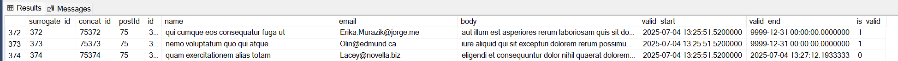

# data_pipelines_dagster
Data pipelines project which uses Dagster as a scheduling tool. In this project, I get fake API data (from JSONPlaceholder), transform it, and insert it into prepared SQL tables. In the next steps, I create simulated new and edited data. I perform Slowly Changing Dimension (type 2) processing to keep data consistency.

I created two Dagster jobs. The first one is an 'initial run' that creates new tables in the local database. The second job simulates new and edited fake data. I schedule the second job to run every 1 minute, which simulates fetching online data from the API. The tables keep updating continuously as long as the Dagster server is running. 

---

## 📦 Dataset

Project based on the Fake API data from from https://jsonplaceholder.typicode.com/, which contains comments (https://jsonplaceholder.typicode.com/comments) and posts (https://jsonplaceholder.typicode.com/comments) data.

---

## 🔧 Project Overview

(data_loader_dagster.py):

Main Python module which contains the DataLoadManager class and SQL schema queries.

(dagster_ops.py):

This file contains simple Dagster operations like fetching data or applying the Slowly Changing Dimension model. It is based on the DataLoadManager class functions.

(dagster_jobs.py):

This file contains Dagster jobs which are built on top of the Dagster ops:

 - etl_initial_job() - creates tables and fetches comments and posts data

 - mock_comment_job() - simulates mock data and inserts this data using the SCD2 model

(dagster_schedule.py):

This file schedules mock_comment_job() to run every one minute.

Other files (resources, config, repository) are used to configure the Dagster pipelines.

---

Dagster:

In a dagster GUI we can see two jobs available. etl_initial_job() should be running once at the start. Then in the mock_comment_job() 'Every minute' ribbon could be clicked to fetch and insert simulated data:

In the 'Runs' Tab every job run could be find with the success/error information:

Slowly Changing DImension 2 (SCD2) Data Model:
To implement SCD2, three columns are added to the SQL table: valid_start, valid_end, and is_valid. They store, respectively, the data fetch date, the end date of validity, and a flag that shows if the row is currently valid.

 

