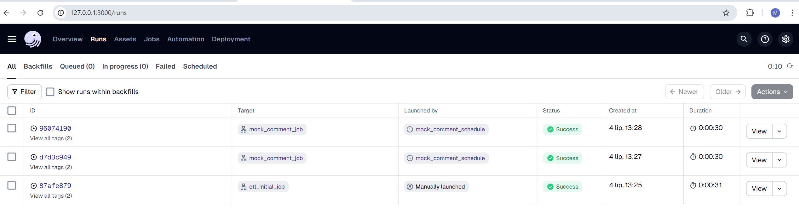

# data_pipelines_dagster
Data pipelines project which use dagster as a scheduler tool. 
In this project I get Fake API data (jsonplaceholder), tranform it and insert into prepared SQL tables. In next steps I create simualated new and edited data. I perform Slowing Changing Dimension (type 2) to keep consistency of data. 
I created two dagster jobs. The first one is a 'initial run' that create new tables in local database. The second job is a simulation of new and edited fake data. I schedule the second job so that it runs every 1 minute which simulate fetching the online data with the API. The tables are updating contiuously if the dagster server is running. 

The diagram below illustrates the overall workflow:

---

## 📦 Dataset

Project based on the Fake API data from from https://jsonplaceholder.typicode.com/, which contains comments (https://jsonplaceholder.typicode.com/comments) and posts (https://jsonplaceholder.typicode.com/comments) data.

---

## 🔧 Project Overview

(`insert_data.ipynb`) :
- The project begins by loading the CSV file into a Python notebook.
- Additional random client data (first name, last name, email) is generated using the 'names' library.
- The enriched dataset is loaded into a SQL table.

This enriched data in the SQL table serves as the starting point for creating a Star Schema

(`data_clean_create_wh.ipynb`): 
- Load data into Python Notebook using SQLAlchemy
- Perform Data Analysis and Cleaning with pandas
- Predict Product Category and Color based on Product Description using a transformer-based LLM model
- Prepare Dimensional Data (split data, create surrogate keys)
- Create the database schema using SQL queries
- Insert dimensional and fact data using BULK INSERT

Dimensional Data Model:

## 📊 Data Analysis (SQL & Power BI)

Based on the created Data Warehouse, key statistics are calculated using SQL queries (`query_wh.ipynb`).

Additionally, a Power BI report has been created to visualize the data:  

